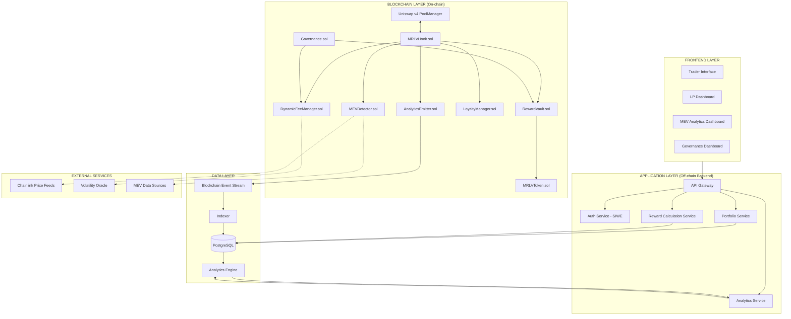
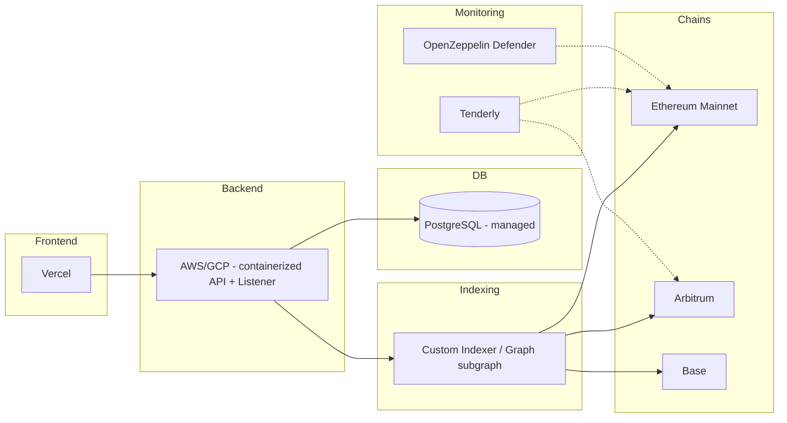

# Architecture.md — Technical Architecture
**Source of truth:** `MRLV_Architecture.md`. This document explains HOW the system is structured and how components interact. See `PRD.md` for what/why, `Rules.md` for engineering guardrails, `Phases.md` for build order, `Design.md` for UI/UX.

---

## 1. Architecture Overview

MRLV is a five-layer system built around a Uniswap v4 hook: a thin on-chain **Hook** (`MRLVHook.sol`) dispatches to specialist on-chain modules (detection, fee computation, reward escrow, loyalty tracking, analytics emission); an off-chain **Indexer** consumes emitted events into a **PostgreSQL** database; a **Backend** application layer serves aggregated and live data to a **Frontend** of four dashboards. Design principle: the hook orchestrates, it does not compute — heavy/historical logic lives off-chain, block-scoped ephemeral logic lives in EIP-1153 transient storage, and nothing fund-affecting is ever decided from off-chain data alone.



---

## 2. Technology Stack

| Layer | Technology | Purpose | Source |
|---|---|---|---|
| Smart contracts | Solidity, Uniswap v4 `IHooks`/`PoolManager` | Hook logic, fee/reward/loyalty accounting | Parts 2–4 |
| Contract dev/test | Foundry (implied by "Foundry-based development and testing workflows" in prior project context; explicitly named in Part 15's testing tasks) | Unit/fuzz/integration testing, deployment scripting | Part 15 |
| Frontend framework | React | Dashboards, trader interface | Part 10.2 |
| Frontend Web3 lib | wagmi/viem | Contract reads/writes from the browser | Part 10.2 |
| Frontend data cache | TanStack Query | Backend data caching | Part 10.2 |
| Frontend hosting | Vercel (Next.js app implied by hosting choice) | Frontend deployment | Part 14 |
| Backend hosting | AWS/GCP, containerized (ECS/Cloud Run) | API + listener services | Part 14 |
| Database | PostgreSQL (managed RDS/Cloud SQL) | Normalized off-chain store | Parts 8, 14 |
| Indexing | Custom lightweight indexer (initial), migration path to The Graph subgraph | Event ingestion | Parts 9, 14 |
| Authentication | SIWE (Sign-In With Ethereum) | Wallet-based session auth, no passwords | Parts 2.2, 9.1 |
| Reward/governance token | ERC-20 (`MRLVToken.sol`, veMRLV) | Reward payout + locked governance voting weight | Part 3.7 |
| Loyalty badge | ERC-721 (soulbound), ERC-1155 considered as alternative | Non-transferable tier badge | Part 7.4 |
| Price oracle | Chainlink Price Feeds | Canonical price reference (never execution price) | Part 2.2 |
| Volatility oracle | Unnamed "Volatility Oracle" (Chainlink/Pyth-style feed referenced in research context) | Bounded reward-multiplier input | Part 2.2 |
| MEV cross-check data | EigenPhi-style API (backend-only, optional) | Off-chain cross-verification, never consumed by the hook | Part 2.2 |
| Monitoring/simulation | Tenderly | Transaction simulation, alerting | Part 14 |
| Ops automation | OpenZeppelin Defender | Automated, access-controlled governance execution and pause control | Part 14 |
| Static analysis | Slither (implied, Part 15 testing tasks) | Self-audit pass | Part 15 |
| Chains | Ethereum mainnet (primary), Arbitrum, Base (planned expansion) | Deployment targets | Part 14 |

Build tooling specifics beyond Foundry (e.g., exact bundler/CI provider), ORM choice, and exact styling framework are **Not specified** in the source.

---

## 3. Application Flow

```
Trader/LP signs tx (wallet) → PoolManager.swap()/modifyLiquidity()
   → MRLVHook callback → specialist module (Detector/FeeManager/LoyaltyManager/RewardVault)
   → state settled via v4 flash accounting → AnalyticsEmitter event emitted
   → Indexer (WebSocket subscription) → Event Processor (idempotent on tx_hash)
   → PostgreSQL → Analytics Service rollups
   → API Gateway → Frontend Dashboards (REST + WebSocket for live ticker)
```
Claim/vote/liquidity actions are always signed and broadcast directly by the user's wallet — the backend never holds custody or relays signed transactions (Part 10.2).

---

## 4. System Components

### On-chain

| Component | Responsibility | Inputs | Outputs | Dependencies | Interactions |
|---|---|---|---|---|---|
| `MRLVHook.sol` | Dispatch all `IHooks` callbacks to specialist modules; holds no business logic | `PoolManager` callback data | `BeforeSwapDelta`, fee overrides, settled deltas | `PoolManager` (inbound only) | Calls all five other on-chain modules |
| `MEVDetector.sol` | Score swaps 0–100 for MEV-like patterns | `PoolKey`, `SwapParams`, tx context, transient storage | `riskScore` | Transient storage set by hook | Read by `MRLVHook.beforeSwap` |
| `DynamicFeeManager.sol` | Convert risk score to a bounded, rate-limited fee | `riskScore`, `poolId` | `uint24` fee | `lastAppliedFee` mapping | Called by `MRLVHook.beforeSwap`; parameters set by `Governance` |
| `RewardVault.sol` | Escrow captured surcharges, compute/pay claims | Surcharge amount, LPScores | Updated `claimable`, ERC-20 transfer | `LoyaltyManager` (scores), `MRLVToken` (payout) | Deposited to by `MRLVHook.afterSwap`; parameters set by `Governance` |
| `LoyaltyManager.sol` | Track tenure/consistency, compute LPScore, manage NFT tiers | Liquidity events, transient JIT flags | `LPScore`, tier, NFT mint/upgrade calls | Loyalty NFT contract | Called by `MRLVHook` on all liquidity callbacks |
| `MRLVToken.sol` | ERC-20 reward/governance token | Mint requests from `RewardVault` | Token balances, lock/voting power | — | Minted only by `RewardVault`; read by `Governance` for voting weight |
| `Governance.sol` | veMRLV-weighted voting on bounded parameters | Proposals, votes | Executed (whitelisted, timelocked) parameter changes | `MRLVToken` (voting power) | Calls `DynamicFeeManager`/`RewardVault` setters only |
| `AnalyticsEmitter.sol` | Single stable event schema | Calls from `MRLVHook` | Emitted events | — | Consumed by the off-chain Indexer |

### Off-chain

| Component | Responsibility | Inputs | Outputs | Dependencies | Interactions |
|---|---|---|---|---|---|
| API Gateway | Single entry point, routing, rate limiting | HTTP/WebSocket requests | Routed responses | Auth, Portfolio, Reward, Analytics services | Frontend-facing |
| Auth Service | SIWE session management | Wallet signature | Session token | — | Gatekeeps API Gateway routes |
| Portfolio Service | Aggregate a wallet's positions across pools | Wallet address | Position summary | PostgreSQL (indexed data only) | Serves LP Dashboard |
| Reward Calculation Service | Off-chain mirror of on-chain LPScore for fast display | Indexed liquidity/reward data | Estimated reward figures (flagged as estimated) | PostgreSQL | Serves LP Dashboard |
| Analytics Service | Serve aggregated MEV/reward statistics | Rollup data | Dashboard datasets | Analytics Engine | Serves MEV Analytics Dashboard |
| Indexer | Subscribe to `AnalyticsEmitter` events | On-chain event stream | Normalized DB rows | WebSocket RPC, confirmation buffer | Writes to PostgreSQL |
| Analytics Engine | Scheduled aggregation (hourly/daily rollups) | Raw indexed rows | Rollup tables/values | PostgreSQL | Feeds Analytics Service |

---

## 5. Folder Structure

**Not specified.** The source document defines contract names, backend services, and frontend pages, but does not define a directory tree, file layout convention, or monorepo/polyrepo structure. Any folder structure used in implementation should be proposed and clearly labeled as such by the implementing team/agent — do not treat any specific path layout as sourced from `MRLV_Architecture.md`.

A minimally necessary, clearly-labeled **proposed** grouping consistent with the contract map in Part 3 and service list in Part 9 would separate: on-chain contracts (one file per contract named exactly as in Part 3.1), an indexer/listener service, a backend API service, and a frontend app with the five pages from Part 10.1 — but exact paths, naming conventions, and tooling config are TBD.

---

## 6. Data Architecture

### On-chain state (see also `Rules.md` for contract-level constraints)
- `MRLVHook.sol`: module addresses, `governance`, `paused` flag. No user-facing mappings.
- `MEVDetector.sol`: `priorityFeeWindow`, `rollingPriorityFeeAvg` (per pool), `crossPoolFlagCount` (optional enhancement).
- `DynamicFeeManager.sol`: `BASE_FEE` (constant), `maxFeeMultiplier`, `HARD_CAP` (constant), `lastAppliedFee` (per pool).
- `RewardVault.sol`: `claimable` (per LP), `totalCaptured`, `totalDistributed`, `insurancePool`, `insuranceBps`, `poolCapturedTotal` (per pool).
- `LoyaltyManager.sol`: `firstDepositBlock`, `liquidityAmount`, `tier`, `flaggedMalicious`, `jitCooldownUntil` — all per LP address.
- `MRLVToken.sol`: standard ERC-20 balances + `locks` (per address: amount, unlock time, voting power).
- `Governance.sol`: `proposals` (by ID), `timelockDelay`.

Full struct/mapping definitions per contract are in Part 3 of `MRLV_Architecture.md` and are not duplicated field-by-field here to avoid redundancy with the source; refer to that document for exact Solidity signatures during implementation.

### Off-chain schema (PostgreSQL, Part 8)

| Table | Key Fields | Relationships | Purpose |
|---|---|---|---|
| Users | `wallet_address (PK)`, `created_at`, `last_seen` | 1→N LiquidityPositions | Identity anchor |
| Pools | `pool_id (PK)`, `token0`, `token1`, `base_fee`, `hook_address`, `created_at` | 1→N LiquidityPositions, SwapEvents | Pool registry |
| LiquidityPositions | `position_id (PK)`, `wallet_address (FK)`, `pool_id (FK)`, `amount`, `first_deposit_block`, `tier`, `active` | N→1 Users, N→1 Pools | Current LP state snapshot |
| SwapEvents | `tx_hash (PK)`, `pool_id (FK)`, `trader`, `amount_in`, `amount_out`, `applied_fee`, `risk_score`, `block_number` | N→1 Pools | Swap history |
| MEVEvents | `event_id (PK)`, `tx_hash (FK)`, `pool_id (FK)`, `risk_score`, `signals_triggered (JSON)`, `surcharge_captured` | N→1 SwapEvents | Denormalized MEV subset (`risk_score > 30`) |
| Rewards | `reward_id (PK)`, `wallet_address (FK)`, `pool_id (FK)`, `epoch`, `amount`, `claimed_at` | N→1 Users, N→1 Pools | Distribution/claim history |
| LPScoreHistory | `history_id (PK)`, `wallet_address (FK)`, `pool_id (FK)`, `epoch`, `score`, `tier` | N→1 Users | Score trend time series |
| GovernanceProposals | `proposal_id (PK)`, `target_contract`, `call_data`, `for_votes`, `against_votes`, `status`, `eta` | — | Mirrors on-chain `Proposal` |

**Validation rule (source-stated):** the database is populated only from indexed on-chain events and is a read-optimized cache — never a source of truth for fund-affecting logic. Any figure a user can act on is re-verified against the contract at action time.

ORM choice, migration tooling, and exact column types/constraints are `Not specified`.

---

## 7. API Architecture

The source names route groups but does not specify full endpoint contracts (methods, request/response bodies, status codes). Documented at the level of specificity given:

| Route group | Purpose | Auth | Source |
|---|---|---|---|
| `/pools` | Pool registry/explorer data | Not specified | Part 9.1 |
| `/lp/:address` | LP position, score, rewards for a wallet | Not specified | Part 9.1 |
| `/mev/analytics` | Aggregated MEV/reward statistics | Not specified | Part 9.1 |
| `/governance/*` | Proposal/voting data | Not specified | Part 9.1 |

Explicitly stated: no JWT — session is SIWE-based (Part 9.1). Exact request/response schemas, versioning, and error-code conventions are **Not specified**; do not invent them — define during implementation and update this section, clearly flagging any newly introduced endpoint as an implementation detail beyond the source.

---

## 8. Authentication & Authorization

- **Authentication mechanism:** SIWE (Sign-In With Ethereum) — wallet signature-based, no custodial credentials or password storage (Parts 2.2, 9.1).
- **Session/token strategy:** Session tokens described as "short-lived" (Part 9.1); exact TTL is `Not specified`.
- **Roles:** Not formally enumerated in the source. Inferable role-like distinctions exist on-chain: `onlyPoolManager` (hook), `onlyHook` (specialist modules), `onlyOracleRelayer` (rolling-average pusher), `onlyRewardVault` (token minting), `onlyLoyaltyManager` (NFT mint/burn), governance-only (`pause`/`unpause`, parameter setters).
- **Permissions:** Governance execution is restricted to whitelisted target contracts/function selectors only (Part 3.8) — it cannot call arbitrary contracts.
- **Protected resources:** Claim, vote, and liquidity-modification actions are always signed directly by the user's wallet; the backend never holds custody or relays these transactions (Part 10.2).
- **Authorization flow:** On-chain authorization is enforced by Solidity modifiers per contract (see `Rules.md` — Security Rules). Off-chain API-level role/permission enforcement beyond SIWE session validity is `Not specified`.

---

## 9. External Integrations

| Integration | Purpose | Consumed by | Trust boundary note |
|---|---|---|---|
| Chainlink Price Feeds | Canonical price reference for price-impact/IL calculations | `MEVDetector.sol` (reads) | Never used as the swap execution price |
| Volatility Oracle | Rolling volatility index for bounded reward-multiplier scaling | `DynamicFeeManager.sol` (reads), stated as an enhancement layer | Bounded input only, never a fund-moving sole decision (Part 12) |
| MEV Data Sources (EigenPhi-style API) | Optional off-chain cross-check of MEV activity | Backend only | Explicitly never consumed by the on-chain hook, to keep on-chain trust surface minimal |
| The Graph | Optional future indexing layer | Off-chain indexer (post-hackathon migration path) | — |
| Tenderly | Transaction simulation, alerting | Ops/monitoring | — |
| OpenZeppelin Defender | Automated governance execution, pause control | Ops/monitoring | Access-controlled |

---

## 10. Error / Data Flow

**On-chain:** malformed or unrecognized `hookData` causes a safe revert rather than a silent fallback (Part 12). `afterSwap` asserts `NonzeroDeltaCount == 0` before returning, preventing any unsettled balance from persisting (Part 12). A governance-controlled `paused` flag reverts all hook callbacks to a safe passthrough (base fee, no detection) in an incident, with no timelock delay on pausing specifically (fast response), though unpausing does go through the normal timelock.

**Off-chain:** the Event Processor is idempotent on `tx_hash` to safely handle redelivered events or chain reorgs; the Indexer waits for N confirmations before writing a row as "final," keeping a small pending buffer for near-tip events (Part 9.1). Exact confirmation count, retry policy, and user-facing error message conventions are `Not specified`.

---

## 11. Deployment Architecture



- **Frontend:** Vercel, preview deployments per PR, production on merge to main (Part 14).
- **Backend:** containerized (ECS/Cloud Run), listener and API tiers scaled/separated so a listener backlog never blocks API latency (Part 14).
- **Database:** managed PostgreSQL with read replicas for the analytics/dashboard query path, separated from the event-processor write path (Part 14).
- **Blockchain:** initial deployment on Ethereum mainnet, Arbitrum and Base as first L2 expansions (Part 14). Testnet (Sepolia) used during development (Part 15, Week 1).
- **Indexing:** custom lightweight indexer first (fastest for a 3-week build), with a documented migration path to a Graph subgraph post-hackathon (Part 14).
- **Monitoring:** Tenderly for simulation/alerting; OpenZeppelin Defender for automated, access-controlled governance execution and pause control (Part 14).

CI/CD pipeline specifics, secrets management, and environment-variable conventions are `Not specified`.

---

## 12. Architectural Decisions

| Decision | Reasoning (source-stated) |
|---|---|
| Hook stays thin, logic delegated to specialist contracts | Independent audit/upgrade/gas-profiling per concern; a bug in one module doesn't require re-auditing swap-critical fee logic (Part 3, intro) |
| Rolling priority-fee average is off-chain-computed, pushed on-chain | True on-chain 7-day averaging is gas-prohibitive per swap; deliberate off-chain/on-chain split, documented for auditors (Part 3.3) |
| Rewards are pull-based (`claim()`), never pushed during `afterSwap` | A malicious LP contract could otherwise revert/grief the swap itself if funds were pushed mid-transaction (Part 3.5) |
| Fee hard cap and rate limit are bytecode-enforced, not governance-only | Prevents even a compromised/malicious governance vote from pushing fees to a DoS-level or manipulable value (Parts 3.4, 6.3, 12) |
| Loyalty NFTs are non-transferable (soulbound) | Prevents loyalty tier from becoming a purchasable secondary-market good, preserving anti-Sybil intent (Part 7.4) |
| Governance can only call whitelisted targets, with mandatory timelock | Closes off arbitrary-call exploit paths; gives users/LPs an exit window if a malicious proposal passes (Part 3.8) |
| Single `AnalyticsEmitter` for all events | Decouples internal contract refactors from the off-chain data pipeline; one stable schema for the indexer (Part 3.9) |
| JIT/tenure logic keys off block-based duration, not single-block snapshots | Neutralizes flash-loan-funded liquidity from earning tenure credit (Part 12) |
