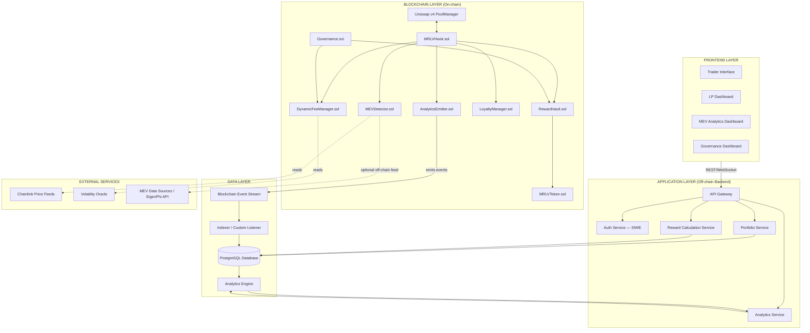
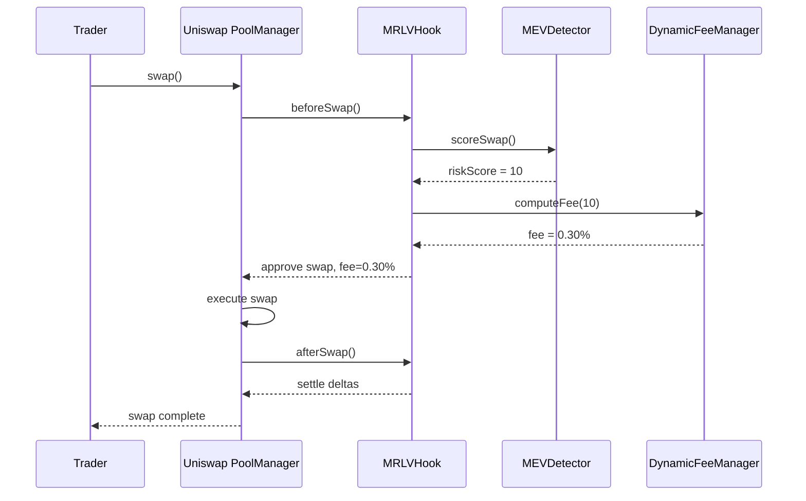
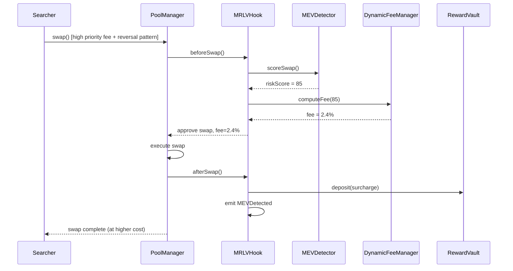
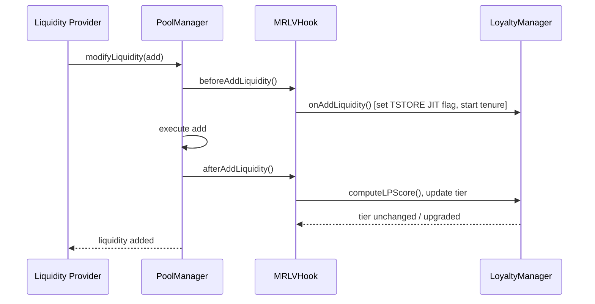
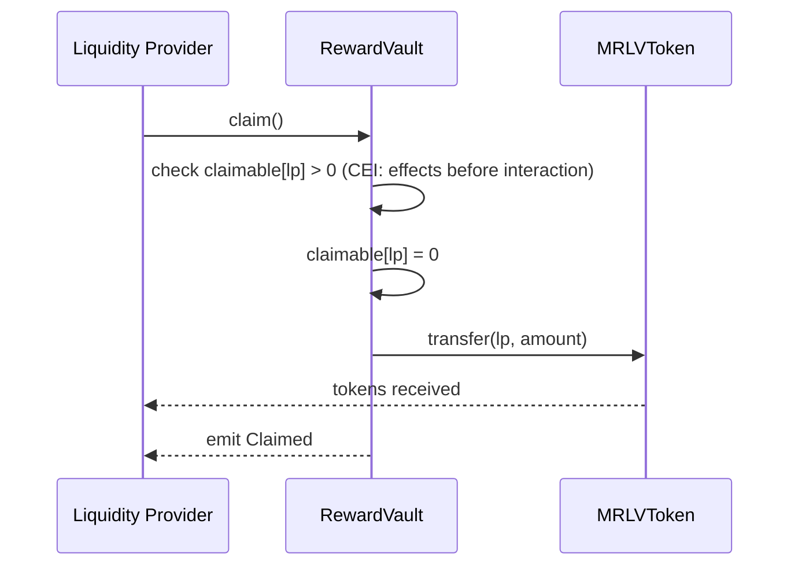
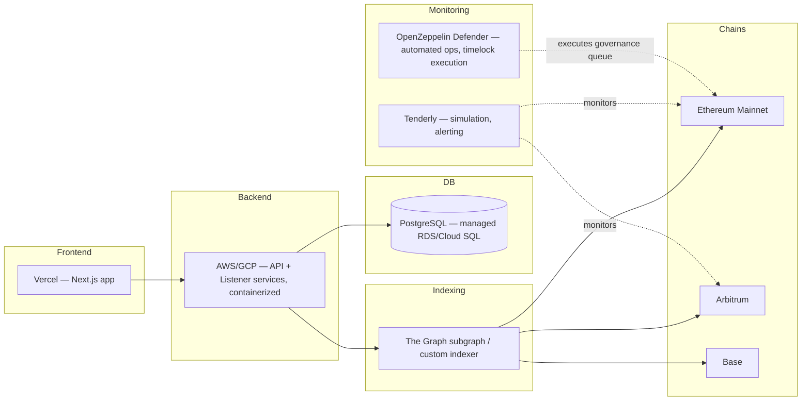
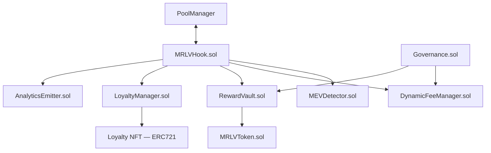
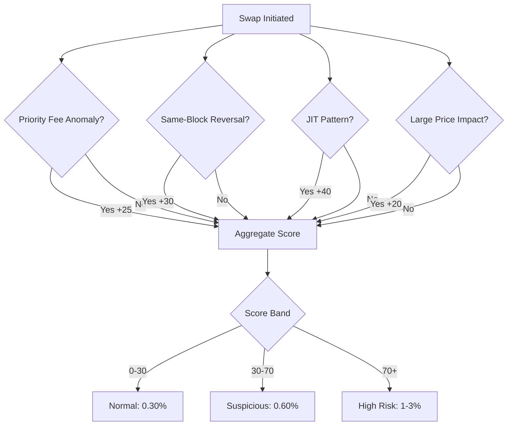
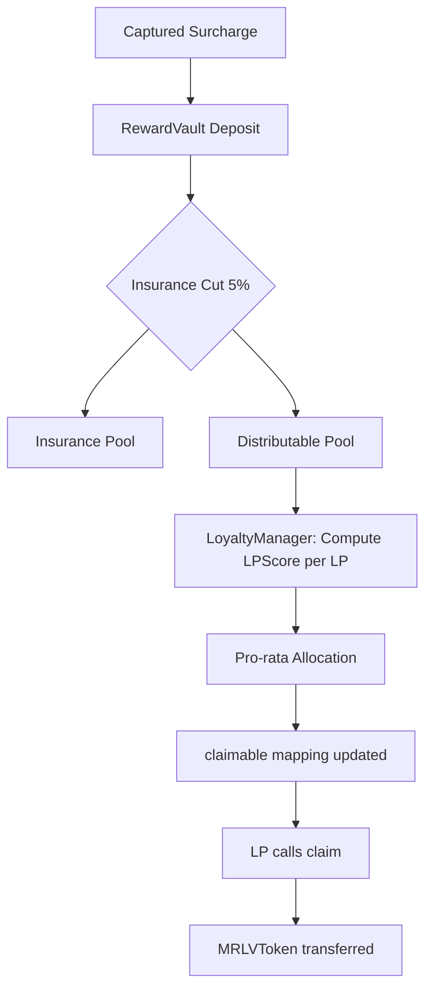
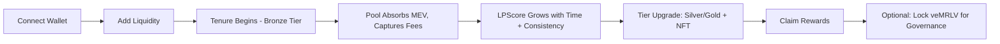

# MEV-Redistributive Liquidity Vault (MRLV)
### Production-Grade Protocol Architecture — Uniswap v4 Hook

---

## PART 1 — SYSTEM OVERVIEW

### 1.1 Executive Summary

Uniswap v4's hook architecture unlocked programmability at the pool level, but it also opened a wider MEV surface: $2.9M/day is currently extracted on v4 versus $1.2M on v3, and JIT liquidity — a v4-native attack — did not meaningfully exist before hooks. Meanwhile LPs lose 15–40% of potential returns to impermanent loss and toxic order flow, and 60% of v4 liquidity is short-term (<30 days), which keeps pools shallow and slippage-prone.

Existing MEV-aware hooks (Detoxer, and similar priority-fee/JIT detectors) treat MEV purely as a threat to be *penalized*. They raise fees on suspicious transactions, but the captured value is either burned, sent to a protocol treasury, or simply lost as reduced attacker profit — none of it flows back to the LPs who bore the risk. This leaves the underlying economic problem unsolved: LPs are still worse off in MEV-heavy pools than in quiet ones.

MRLV reframes the problem. It keeps the same detection primitives (priority-fee deviation, same-block reversal, JIT patterns) but changes what happens to the captured surcharge: instead of it disappearing, it is routed into a **Reward Vault** and distributed to LPs weighted by tenure and behavior. MEV stops being a pure negative externality and becomes a redistributive fee mechanism — the protocol's defensive action *is* the LP's yield source.

**Why this matters to reviewers:** MRLV is not proposing a new detection algorithm (that ground is well-trodden). Its novelty is entirely in the *accounting and incentive design* downstream of detection — which is exactly the layer Uniswap v4's hook model was built to make composable.

### 1.2 Core Innovation — The Flywheel

**Traditional MEV flow:**
```
Searcher → Extracts value → LP/User loses → (value leaves the system permanently)
```

**MRLV flow:**
```
Searcher activity → Detection (beforeSwap) → Dynamic fee surcharge captured
      → Reward Vault (escrow) → LP Score-weighted distribution → Long-term LPs earn boosted yield
```

**The flywheel loop:**

1. MEV activity is detected and taxed at the point of swap (no new trust assumptions — it happens inside the same atomic transaction).
2. The surcharge (the delta between base fee and MEV-adjusted fee) is escrowed, not burned.
3. Rewards accrue to LPs proportional to a **LPScore** (tenure × consistency × contribution × clean-behavior flag).
4. Higher expected yield attracts more long-term liquidity.
5. Deeper, stickier liquidity reduces price impact per trade, which mechanically *reduces* the profitability of sandwich attacks and lowers slippage for genuine traders.
6. Lower attacker profitability → MEV attempts either decline or migrate toward legitimate arbitrage volume (which is not penalized) → the tax base shrinks, but so does the LP's IL exposure, and both effects favor long-term LPs.

The system is explicitly *not* claiming to capture externally-executed MEV profit (e.g., a searcher's atomic arbitrage against a CEX) — it only captures **additional protocol fees generated from detected MEV-like transaction patterns inside the pool itself**. This distinction matters both legally and technically and should be stated verbatim in all public materials: *"MRLV captures additional protocol fees generated from detected MEV activity — it does not claim, seize, or redirect a third party's realized MEV profit."*

---

## PART 2 — HIGH-LEVEL SYSTEM ARCHITECTURE

### 2.1 Architecture Diagram



### 2.2 Component Explanations

**Frontend Layer**
- *Trader Interface* — standard swap UI; surfaces the current dynamic fee tier before the trader signs, so fee changes are never a surprise.
- *LP Dashboard* — liquidity position, LPScore, loyalty tier, accrued/claimable rewards.
- *MEV Analytics Dashboard* — public, real-time view of captured MEV, redistributed rewards, and flagged addresses (transparency layer).
- *Governance Dashboard* — veMRLV holders view/create/vote on proposals.

**Application Layer**
- *API Gateway* — single entry point, rate limiting, request routing.
- *Auth Service* — Sign-In-With-Ethereum (SIWE); no custodial credentials.
- *Portfolio Service* — aggregates a wallet's positions across pools using indexed data (never trusts client-supplied balances).
- *Reward Calculation Service* — mirrors the on-chain LPScore formula off-chain for fast UI display; the source of truth for actual claims always remains the contract.
- *Analytics Service* — serves aggregated MEV/reward statistics to the dashboards.

**Blockchain Layer** — detailed in Part 3.

**Data Layer**
- *Indexer* — a custom lightweight listener (or The Graph subgraph) subscribed to `AnalyticsEmitter` events; this is the only place heavy computation/history lives, keeping the hook itself cheap.
- *PostgreSQL* — normalized store, schema in Part 8.
- *Analytics Engine* — scheduled aggregation jobs (hourly/daily rollups, LP leaderboard, pool resilience score).

**External Services**
- *Chainlink Price Feeds* — canonical price reference for price-impact and IL calculations (never used as the swap execution price).
- *Volatility Oracle* — feeds a rolling volatility index used to scale reward multipliers (Part 3, enhancement layer).
- *MEV Data Sources* — optional off-chain cross-check (EigenPhi-style APIs) consumed by the backend only, never by the hook — keeps the on-chain trust surface minimal.

### 2.3 Communication Flow (Summary)

```
Trader signs swap → PoolManager.swap() → MRLVHook.beforeSwap()
   → MEVDetector scores the tx → DynamicFeeManager sets fee
   → swap executes → MRLVHook.afterSwap()
   → captured surcharge routed to RewardVault, AnalyticsEmitter fires events
   → Indexer picks up events → DB updated → Backend serves updated dashboards
```

---

## PART 3 — SMART CONTRACT ARCHITECTURE

Design goal: the **Hook itself stays thin**. It orchestrates; it does not compute. Each concern lives in its own contract so it can be audited, upgraded (via governance-gated pointers), and gas-profiled independently.

### 3.1 Contract Map

| Contract | Responsibility |
|---|---|
| `MRLVHook.sol` | Implements `IHooks`; routes callbacks to the specialist modules; holds no business logic |
| `MEVDetector.sol` | Stateless-as-possible scoring logic; reads transient storage for block-level context |
| `DynamicFeeManager.sol` | Converts a risk score into a fee override, enforces caps |
| `RewardVault.sol` | Escrows captured fees, computes/pays claims |
| `LoyaltyManager.sol` | Tracks LP tenure, consistency, mints/updates loyalty NFTs |
| `MRLVToken.sol` | ERC-20 (veMRLV) reward/governance token |
| `Governance.sol` | Parameter voting, timelocked execution |
| `AnalyticsEmitter.sol` | Centralized, indexed event surface for the off-chain indexer |

### 3.2 `MRLVHook.sol`

**Purpose:** The only contract `PoolManager` calls. A pure dispatcher — every callback delegates to a specialist contract and forwards return data. Keeping it thin means a bug in, say, `LoyaltyManager` doesn't require re-auditing swap-critical fee logic.

**State variables**
```solidity
IPoolManager public immutable poolManager;
MEVDetector public detector;
DynamicFeeManager public feeManager;
RewardVault public rewardVault;
LoyaltyManager public loyaltyManager;
AnalyticsEmitter public analytics;
address public governance;
bool public paused; // circuit breaker, governance-controlled
```

**Structs**
```solidity
struct SwapContext {
    address trader;
    bool zeroForOne;
    int256 amountSpecified;
    uint256 riskScore;
    uint24 appliedFee;
}
```

**Mappings** — none held directly (delegated to modules); this is intentional to keep the hook's own storage footprint minimal.

**Important functions**
- `beforeInitialize` / `afterInitialize` — pool validation, optional LP whitelist check via `Governance`.
- `beforeSwap` — pulls a risk score from `MEVDetector`, a fee from `DynamicFeeManager`, returns a `BeforeSwapDelta` and dynamic fee override.
- `afterSwap` — computes the realized surcharge, forwards it to `RewardVault.deposit()`, tells `LoyaltyManager` to update stats, emits via `AnalyticsEmitter`.
- `beforeAddLiquidity` / `afterAddLiquidity` — JIT window check, loyalty tenure start/continuation.
- `beforeRemoveLiquidity` / `afterRemoveLiquidity` — exit-penalty check, final score recalculation.
- `pause()` / `unpause()` — governance-only circuit breaker.

**Events emitted:** none directly — delegated to `AnalyticsEmitter` so all events share one indexable source (reduces indexer complexity and avoids duplicate event schemas).

**External calls:** `PoolManager` (inbound only, `onlyPoolManager` modifier), and outbound calls to its five specialist modules — all of which are pre-registered addresses set once at deploy time and only changeable via timelocked governance.

**Security considerations**
- `onlyPoolManager` modifier on every callback — never trust `msg.sender` beyond the canonical `PoolManager` singleton.
- Module addresses are `immutable` where possible; where they must be mutable (for post-audit patchability), changes go through `Governance`'s timelock, never a raw setter.
- No hook callback ever transfers user funds directly — value movement is confined to the flash-accounting delta returned to `PoolManager`, per v4 convention.

### 3.3 `MEVDetector.sol`

**Purpose:** Turn raw swap/tx context into a 0–100 risk score.

**State variables**
```solidity
uint256 public priorityFeeWindow;      // e.g., 7-day rolling window length in blocks
mapping(bytes32 => uint256) public rollingPriorityFeeAvg; // per-pool
```

**Structs**
```solidity
struct RiskFactors {
    uint8 priorityFeeAnomaly;   // 0 or 25
    uint8 sameBlockReversal;    // 0 or 30
    uint8 largePriceImpact;     // 0 or 20
    uint8 jitPattern;           // 0 or 40
}
```

**Mappings**
```solidity
mapping(address => uint256) public crossPoolFlagCount; // optional Part-2 enhancement: reputation
```

**Important functions**
- `scoreSwap(PoolKey, SwapParams, address trader) → uint256 riskScore`
- `_checkPriorityFeeAnomaly()` — compares `tx.gasprice - block.basefee` to the stored rolling average; the rolling average itself is updated off-chain-computed and pushed via a governance-permissioned oracle call to avoid unbounded on-chain historical storage (an on-chain-only 7-day average is prohibitively expensive to compute per-block; this is a deliberate off-chain/on-chain split documented for auditors).
- `_checkSameBlockReversal()` — reads **transient storage** (`TSTORE`/`TLOAD`, EIP-1153) keyed by `pool + block.number` to see if the same `tx.origin` already swapped in the opposite direction this block.
- `_checkJIT()` — reads a transient flag set by `beforeAddLiquidity` for `(pool, address, block.number)`.

**Events:** `RiskScored(pool, trader, score)` (relayed through `AnalyticsEmitter`).

**External calls:** none in the hot path (transient storage is intra-transaction, not an external call); the rolling-average update is called by a permissioned relayer, not by users.

**Security considerations**
- Transient storage is cleared automatically at end-of-transaction by the EVM — no manual cleanup risk, no cross-transaction storage bloat, no persistent-storage collision surface.
- The rolling-average *push* function must be access-controlled (`onlyOracleRelayer`) and rate-limited, or an attacker could manipulate the "normal" baseline to make their own txs look clean.
- Detection is probabilistic by design — false positives are expected and handled economically (a mild fee increase, not a block), see Part 5.

### 3.4 `DynamicFeeManager.sol`

**Purpose:** Convert a risk score into an actual pool fee, within hard governance-set bounds.

**State variables**
```solidity
uint24 public constant BASE_FEE = 3000;       // 0.30% in v4 fee units (hundredths of a bip *100)
uint24 public maxFeeMultiplier;                // governance-set, capped ≤ 5x internally, enforced ≤3x per design principle
uint24 public constant HARD_CAP = 30000;       // 3% absolute ceiling
mapping(bytes32 => uint24) public lastAppliedFee; // per-pool, for rate-limiting fee jumps
```

**Structs**
```solidity
struct FeeTier { uint24 threshold; uint24 feeBps; }
```

**Mappings** — `lastAppliedFee` above; used to enforce "≤3× base fee change per block" from the security best-practices.

**Important functions**
- `computeFee(uint256 riskScore, bytes32 poolId) → uint24`
  - 0–30 → `BASE_FEE` (0.3%)
  - 30–70 → 0.6% (2×)
  - 70+ → scaled linearly between 1%–3%, hard-capped at `HARD_CAP`
- `_rateLimit(bytes32 poolId, uint24 proposedFee) → uint24` — clamps the delta from `lastAppliedFee` to the governance-set max per-block multiplier.

**Events:** `FeeAdjusted(poolId, oldFee, newFee, riskScore)`.

**External calls:** none — pure computation over on-chain state.

**Security considerations**
- Hard-coded `HARD_CAP` (not just a governance variable) so even a compromised or malicious governance vote cannot push fees beyond a value that would itself constitute a DoS on traders.
- Rate-limiting prevents a "flash fee" grief where an attacker forces the *next unrelated trader* into a spiking fee.

### 3.5 `RewardVault.sol`

**Purpose:** Escrow captured surcharges and pay out to LPs based on `LoyaltyManager`-supplied scores.

**State variables**
```solidity
mapping(address => uint256) public claimable;     // per-LP pending rewards
uint256 public totalCaptured;
uint256 public totalDistributed;
address public insurancePool;                      // optional enhancement, Part 3.9
uint16 public insuranceBps;                         // e.g. 500 = 5%
```

**Structs**
```solidity
struct Deposit { bytes32 poolId; uint256 amount; uint256 blockNumber; }
```

**Mappings** — `claimable` above; `mapping(bytes32 => uint256) public poolCapturedTotal` for per-pool accounting/transparency.

**Important functions**
- `deposit(bytes32 poolId, uint256 amount)` — `onlyHook`; splits `insuranceBps` to the insurance pool, remainder to the distributable pool.
- `distribute(bytes32 poolId)` — pulls current LPScores from `LoyaltyManager`, allocates `claimable[lp] += share`.
- `claim()` — pull-based withdrawal, standard checks-effects-interactions, reentrancy guard.

**Events:** `Deposited`, `Distributed`, `Claimed`.

**External calls:** ERC-20 `transfer`/token payout on `claim()` — this is the single highest-risk external call in the system and is guarded with `nonReentrant` + CEI ordering + pull-payment pattern (never push funds to LPs automatically).

**Security considerations**
- Pull-payment (not push) is mandatory — push-payments to arbitrary LP addresses during `afterSwap` would let a malicious LP contract revert/grief the swap itself.
- `distribute()` is idempotent-safe: it operates on deltas, not full re-computation, to prevent double-distribution if called twice in the same block.

### 3.6 `LoyaltyManager.sol`

**Purpose:** Own the LPScore state machine and loyalty NFT issuance.

**State variables**
```solidity
mapping(address => uint256) public firstDepositBlock;
mapping(address => uint256) public liquidityAmount;
mapping(address => uint8) public tier; // 0=Bronze,1=Silver,2=Gold
mapping(address => bool) public flaggedMalicious;
```

**Structs**
```solidity
struct LPScoreInputs {
    uint256 amount;
    uint256 durationBlocks;
    uint256 consistencyIndex; // e.g., stddev of position size over time, lower = more consistent
    uint256 poolContributionBps;
    bool clean;
}
```

**Mappings** — as above, plus `mapping(address => uint256) public jitCooldownUntil` for JIT-detected LPs.

**Important functions**
- `onAddLiquidity()`, `onRemoveLiquidity()` — lifecycle hooks called by `MRLVHook`.
- `computeLPScore(address lp) → uint256`
- `_checkJITPattern(address lp)` — same-block add+swap+remove detection using transient storage set by the hook.
- `mintOrUpgradeLoyaltyNFT(address lp)` — calls the ERC-721/1155 loyalty badge contract when a tier threshold is crossed.

**Events:** `TierUpgraded`, `JITFlagged`, `ExitPenaltyApplied`.

**External calls:** loyalty NFT contract (`mint`/`burn`), guarded by `onlyLoyaltyManager` on the NFT side.

**Security considerations**
- JIT detection and exit-penalty logic must use `>=` boundary checks carefully (off-by-one on the "7-day" threshold is a classic audit finding) and should be covered by explicit boundary unit tests.
- Loyalty NFTs are **non-transferable** (soulbound) — otherwise loyalty tier becomes a purchasable secondary-market good, defeating the anti-Sybil purpose.

### 3.7 `MRLVToken.sol`

**Purpose:** ERC-20 reward/governance token (veMRLV) minted on reward distribution, lockable for voting power.

**State variables:** standard ERC-20 + `mapping(address => LockInfo) public locks` (amount, unlock timestamp, voting weight).

**Structs:** `struct LockInfo { uint256 amount; uint256 unlockTime; uint256 votingPower; }`

**Important functions:** `mint()` (`onlyRewardVault`), `lock()`, `withdraw()`, `votingPowerOf()`.

**Events:** `Locked`, `Unlocked`.

**External calls:** none beyond standard ERC-20 semantics.

**Security considerations:** minting authority restricted to `RewardVault` only; no admin mint function exists post-deployment (removes a classic rug vector).

### 3.8 `Governance.sol`

**Purpose:** veMRLV-weighted voting over bounded parameter ranges (fee multiplier, reward split, volatility thresholds) — never over arbitrary code execution without a timelock.

**State variables:** `mapping(uint256 => Proposal) public proposals`, `uint256 public timelockDelay`.

**Structs:** `struct Proposal { address target; bytes callData; uint256 eta; uint256 forVotes; uint256 againstVotes; bool executed; }`

**Important functions:** `propose()`, `vote()`, `queue()`, `execute()` (post-timelock only).

**Events:** `ProposalCreated`, `Voted`, `Executed`.

**External calls:** whitelisted target contracts only (`DynamicFeeManager`, `RewardVault` parameter setters) — governance cannot call arbitrary contracts, closing off a common exploit path.

**Security considerations:** mandatory timelock (48–72h) on every executed proposal gives LPs/users an exit window if a malicious proposal passes; parameter setters enforce the same hard caps described in 3.4 regardless of vote outcome.

### 3.9 `AnalyticsEmitter.sol`

**Purpose:** Single, stable event schema for the indexer — decouples internal contract refactors from the off-chain data pipeline.

**Important functions:** `emitSwapProcessed()`, `emitMEVDetected()`, `emitRewardDistributed()`, `emitLoyaltyChanged()` — thin wrappers, `onlyHook`.

**Events:** `SwapProcessed`, `MEVDetected`, `FeeCaptured`, `RewardDistributed`, `LoyaltyTierChanged`, `GovernanceExecuted`.

**Security considerations:** emits data only, never mutates state — cannot itself be an attack surface for fund loss, simplifying its audit scope to "does it emit accurate data."

---

## PART 4 — UNISWAP V4 HOOK CALLBACK FLOW

### 4.1 `beforeInitialize()`
- **Pool validation:** confirm `PoolKey.hooks == address(this)` (v4 enforces this via the address-mining convention, but the hook re-checks token ordering and fee-tier sanity).
- **Initial configuration:** if `Governance` has enabled LP whitelisting for this deployment phase, verify `msg.sender` (the pool creator) is approved; otherwise revert. Initializes `DynamicFeeManager`'s starting fee for the pool to `BASE_FEE`.

### 4.2 `beforeSwap()`

```
Swap parameters (PoolKey, SwapParams, hookData)
        ↓
MEVDetector.scoreSwap()
   ├─ Priority fee analysis: (tx.gasprice - block.basefee) vs rolling 7-day avg → +25 if >2σ
   ├─ Block position tracking: TLOAD first-swap-this-block slot → penalize top-3 positions
   ├─ Same-block reverse swap detection: TLOAD direction flag for tx.origin this block
   └─ JIT detection: TLOAD add-liquidity-this-block flag for tx.origin
        ↓
Aggregate risk score (0-100)
        ↓
DynamicFeeManager.computeFee(riskScore) → rate-limited fee
        ↓
Swap approved with BeforeSwapDelta + dynamic fee override returned to PoolManager
```
Every read above (transient storage TLOAD, rolling-average SLOAD) is O(1) and bounded — critical for keeping `beforeSwap` gas cost predictable, since it runs on every single swap regardless of risk.

### 4.3 `afterSwap()`
- Capture additional fees: compute `appliedFee - BASE_FEE` delta on the actual swap notional, forward to `RewardVault.deposit()`.
- Update MEV statistics: increment per-pool/per-block counters used by `MEVDetector`'s rolling average (written to a governance-controlled off-chain-fed slot, not recomputed live).
- Emit events via `AnalyticsEmitter.emitSwapProcessed()` / `emitMEVDetected()` if flagged.
- Update reward accounting: no distribution happens here (that's asynchronous, batched in `RewardVault.distribute()`) — `afterSwap` only *deposits*, keeping the hot path cheap.

### 4.4 `beforeAddLiquidity()`
- Detect JIT liquidity providers: `TSTORE` a flag `(pool, sender, block.number) = true` so a same-block `beforeSwap`/`afterRemoveLiquidity` can see it.
- Store timestamps: if this is a new LP, `LoyaltyManager.firstDepositBlock[lp] = block.number`.
- Initialize LP tracking: seed `liquidityAmount[lp]`.

### 4.5 `afterAddLiquidity()`
- Update loyalty score: recompute `LPScoreInputs` and persist tier if crossed (may trigger NFT mint).

### 4.6 `beforeRemoveLiquidity()`
- Exit penalties: if `block.number - firstDepositBlock[lp] < earlyWithdrawWindow` (e.g., 7 days in blocks), flag for penalty.
- Early withdrawal logic: penalty forfeits a portion (e.g., 50%) of *accrued, unclaimed* rewards only — never principal — back into `RewardVault` for redistribution to remaining LPs.

### 4.7 `afterRemoveLiquidity()`
- Final reward calculation: settle any pending `claimable` delta for this LP and update `LoyaltyManager` state (tier may downgrade if liquidity drops below a tier's amount threshold).

---

## PART 5 — MEV DETECTION ENGINE DESIGN

### 5.1 Risk Scoring System

| Signal | Points |
|---|---|
| Priority fee anomaly (>2σ above 7-day rolling avg) | +25 |
| Same-block opposite-direction swap (same `tx.origin`) | +30 |
| Large price impact (> pool-specific threshold, e.g. >1%) | +20 |
| JIT liquidity pattern (add→swap→remove same block) | +40 |

Scores are additive and capped at 100.

**Bands**
- **0–30 → Normal:** base fee applies, no flag.
- **30–70 → Suspicious:** moderate fee surcharge (0.6%), soft-flagged in analytics, no reputational penalty yet.
- **70+ → High-probability MEV:** high surcharge (1–3%), hard-flagged, contributes to the optional cross-pool reputation counter.

### 5.2 Reducing False Positives

- **Multi-signal requirement for the top band:** a single signal (e.g., only "large price impact," which also happens for legitimate large trades) cannot alone reach 70+; that requires at least two independent signals, which large-but-innocent trades rarely trigger simultaneously.
- **Economic softness, not blocking:** even a "High probability" score only raises the fee — it never reverts or blocks a transaction. A false positive costs a genuine trader a temporarily higher fee, not a failed transaction, which keeps the failure mode proportionate.
- **Rolling baseline instead of a fixed threshold:** the 7-day moving average adapts to each pool's own volatility regime, so a naturally high-gas-price period (network congestion) doesn't uniformly misclassify the whole pool.
- **Reputation requires repetition:** the cross-pool blacklist enhancement only escalates after an address is flagged in >5 pools within 24h — a single mis-scored trade never follows an address around.
- **Governance-tunable weights:** if empirical data post-launch shows a specific signal (e.g., price impact) over-triggers for a specific pool type (e.g., stable pairs), `Governance` can retune that signal's weight within bounded ranges without a redeploy.

---

## PART 6 — DYNAMIC FEE ENGINE DESIGN

### 6.1 Fee Tiers

| Risk Band | Fee |
|---|---|
| Normal (0–30) | 0.30% |
| Suspicious (30–70) | 0.60% |
| High-risk MEV (70+) | 1%–3%, linear scale on score within band |

### 6.2 Fee Calculation Formula

```
if riskScore < 30:      fee = BASE_FEE                          // 3000 (0.30%)
elif riskScore < 70:    fee = BASE_FEE * 2                       // 6000 (0.60%)
else:
    scaled = 10000 + ((riskScore - 70) * (30000 - 10000) / 30)  // linear 1%→3% across 70-100
    fee = min(scaled, HARD_CAP)

fee = rateLimit(fee, lastAppliedFee[poolId], maxDeltaPerBlock)
```

### 6.3 Maximum Fee Limits
- Absolute hard cap: **3%** (`HARD_CAP`), enforced in `DynamicFeeManager` bytecode, not a governance variable.
- Per-block rate limit: fee cannot move more than **3× its previous value** in a single block (matches the security-best-practice table's requirement and is intentionally stricter than Detoxer's 5×).

### 6.4 Anti-Manipulation Controls
- Rate limiting (above) prevents an attacker from forcing a fee spike onto the *next* trader by self-triggering a high score, then having an accomplice trade immediately after at the inflated fee — the delta is capped regardless of score jumps.
- The rolling priority-fee average is updated only by a permissioned relayer on a fixed cadence (not per-swap), so no single transaction can shift its own baseline.
- Fee changes always emit `FeeAdjusted` — full transparency, auditable off-chain in real time.

### 6.5 Governance Parameters
Tunable within hard-coded bounds only: base fee (within a narrow band, e.g. 0.05%–0.5%), suspicious-tier multiplier (1.5×–3×), max-fee-per-block delta multiplier (≤3×), risk-band thresholds (±10 points from defaults).

---

## PART 7 — LP REWARD SYSTEM DESIGN

### 7.1 Reward Architecture

```
Captured Fee (afterSwap delta)
        ↓
Reward Vault (escrow, minus insurance-pool cut)
        ↓
LP Score Calculation (LoyaltyManager, per distribution epoch)
        ↓
Reward Distribution (pro-rata by score, pull-claim)
```

### 7.2 LPScore Formula

```
LPScore(lp) =
      w1 * normalize(liquidityAmount)
    + w2 * normalize(durationBlocks)
    + w3 * (1 / (1 + consistencyPenalty))
    + w4 * normalize(poolContributionBps)
    - penalty * (flaggedMalicious ? 1 : 0)

where w1+w2+w3+w4 = 1, default weights: w1=0.35, w2=0.30, w3=0.15, w4=0.20
```
- `normalize()` scales each raw input to [0,1] relative to the pool's current LP population, recomputed each distribution epoch — prevents any single whale from needing special-casing.
- `consistencyPenalty` — standard deviation of the LP's position size over the epoch; volatile in/out behavior scores worse than a stable position, which discourages "deposit right before a big captured-fee event, withdraw right after" gaming.
- `flaggedMalicious` — set by `LoyaltyManager` on confirmed JIT/exit-penalty violations; zeroes out the reward share for that epoch without touching principal.

### 7.3 Reward Multipliers

| Tier | Tenure | Multiplier |
|---|---|---|
| Bronze | <30 days | 1× |
| Silver | 30–90 days | 2× |
| Gold | >90 days | 3× + governance voting weight |

### 7.4 NFT Loyalty Implementation

- **Standard:** ERC-721 (one badge per LP position, since tenure/tier is inherently unique per depositor per pool) with ERC-1155 considered as an alternative if a single wallet holds positions across many pools and a batched badge is preferred for gas efficiency.
- **Soulbound:** `transfer()`/`safeTransferFrom()` overridden to revert — prevents tier from becoming a purchasable proxy, preserving the anti-Sybil property.
- **Metadata:** on-chain tier + off-chain-hosted (IPFS) art asset per tier, refreshed automatically on `TierUpgraded` events.
- **Utility:** Gold badge holders receive governance voting weight on top of their veMRLV lock — ties visual prestige to real protocol influence, which is the "high visual impact, easy to demo" item flagged as a Week-2 priority in the research.

---

## PART 8 — DATABASE ARCHITECTURE (Off-Chain)

| Table | Key Fields | Relationships | Purpose |
|---|---|---|---|
| **Users** | `wallet_address (PK)`, `created_at`, `last_seen` | 1→N LiquidityPositions | Identity anchor for the frontend/API layer |
| **Pools** | `pool_id (PK)`, `token0`, `token1`, `base_fee`, `hook_address`, `created_at` | 1→N LiquidityPositions, SwapEvents | Pool registry mirrored from `beforeInitialize` events |
| **LiquidityPositions** | `position_id (PK)`, `wallet_address (FK)`, `pool_id (FK)`, `amount`, `first_deposit_block`, `tier`, `active` | N→1 Users, N→1 Pools | Current LP state snapshot |
| **SwapEvents** | `tx_hash (PK)`, `pool_id (FK)`, `trader`, `amount_in`, `amount_out`, `applied_fee`, `risk_score`, `block_number` | N→1 Pools | Full swap history for analytics |
| **MEVEvents** | `event_id (PK)`, `tx_hash (FK)`, `pool_id (FK)`, `risk_score`, `signals_triggered (JSON)`, `surcharge_captured` | N→1 SwapEvents | Filtered subset of SwapEvents where `risk_score > 30`, denormalized for fast dashboard queries |
| **Rewards** | `reward_id (PK)`, `wallet_address (FK)`, `pool_id (FK)`, `epoch`, `amount`, `claimed_at` | N→1 Users, N→1 Pools | Distribution + claim history |
| **LPScoreHistory** | `history_id (PK)`, `wallet_address (FK)`, `pool_id (FK)`, `epoch`, `score`, `tier` | N→1 Users | Time series for the LP dashboard's score trend chart |
| **GovernanceProposals** | `proposal_id (PK)`, `target_contract`, `call_data`, `for_votes`, `against_votes`, `status`, `eta` | — | Mirrors on-chain `Proposal` structs for the governance UI |

All tables are populated **only** from indexed on-chain events — the database is a read-optimized cache, never a source of truth for fund-affecting logic. Any figure shown to a user that affects a claim amount is re-verified against the contract at claim time.

---

## PART 9 — BACKEND ARCHITECTURE

### 9.1 Services

- **API Gateway** — routes `/pools`, `/lp/:address`, `/mev/analytics`, `/governance/*`; JWT-free, SIWE-session based.
- **Authentication** — SIWE (Sign-In With Ethereum), no password storage, session tokens short-lived.
- **Blockchain Listener** — subscribes to `AnalyticsEmitter` events via WebSocket RPC, with a polling fallback and reorg-safety (waits N confirmations before writing a "final" row, keeps a small pending buffer for near-tip events).
- **Event Processor** — normalizes raw events into the DB schema above; idempotent on `tx_hash` to safely handle redelivery/reorgs.
- **Reward Calculator** — off-chain mirror of the on-chain LPScore formula for instant UI feedback; flagged clearly in the API response as "estimated, pending on-chain confirmation."
- **Analytics Service** — scheduled rollups (hourly MEV captured, daily LP leaderboard, per-pool "resilience score" = captured-MEV / TVL).

### 9.2 Data Flow

```
Blockchain Event (AnalyticsEmitter)
        ↓
Indexer (WebSocket subscription + confirmation buffer)
        ↓
Event Processor → Backend normalizes → PostgreSQL
        ↓
Analytics Service rollups
        ↓
API Gateway serves → Frontend dashboards (REST + WebSocket for live ticker)
```

---

## PART 10 — FRONTEND ARCHITECTURE

### 10.1 Pages

1. **Landing Page** — protocol explainer, live "MEV redirected to LPs" counter (pulls from Analytics Service), CTA to connect wallet.
2. **LP Dashboard** — current liquidity, claimable rewards (claim button → direct contract call, never routed through the backend), LPScore trend chart, loyalty tier + NFT badge display.
3. **MEV Analytics Dashboard** — MEV detected over time (by risk band), fees captured vs. redistributed, per-pool resilience score, flagged-address list (addresses only — no personal data).
4. **Governance Dashboard** — active proposals, voting UI (direct contract call), veMRLV lock/voting-power management.
5. **Pool Explorer** — searchable pool list, TVL, current dynamic fee, historical fee-band distribution chart.

### 10.2 Component Notes
- Component library: React + wagmi/viem for contract reads/writes, TanStack Query for backend data caching.
- Every dollar figure shown that a user can act on (claim, withdraw) is fetched live from the contract at action time — dashboard aggregates are for browsing/trend context only, never the transaction's actual source of truth.
- The claim/vote/withdraw flows never hold custody or relay signed transactions through the backend — wallet signs and broadcasts directly.

---

## PART 11 — SEQUENCE DIAGRAMS

### 11.1 Normal Swap


### 11.2 MEV Attack (Detected & Taxed)


### 11.3 LP Deposit


### 11.4 Reward Claim


---

## PART 12 — SECURITY ARCHITECTURE

| Threat | Mitigation |
|---|---|
| **Reentrancy** | `RewardVault.claim()` uses checks-effects-interactions + `nonReentrant`; no hook callback performs an external token transfer mid-swap-accounting |
| **HookData validation** | All `bytes hookData` inputs are length-checked and ABI-decoded defensively; unrecognized/malformed data causes a safe revert, never a silent fallback into unintended logic |
| **Oracle manipulation** | Volatility/price oracle reads use Chainlink with staleness checks (`updatedAt` freshness) and are never the sole input to a fund-moving decision — only to a bounded reward multiplier |
| **Transient storage safety** | All TSTORE/TLOAD keys are namespaced by `(poolId, address, block.number)` to avoid cross-pool or cross-block collisions; EVM auto-clears at tx end, removing manual-cleanup risk |
| **Flash loan attacks** | JIT/reward logic keys off *tenure in blocks*, not a single-block liquidity snapshot — a flash-loaned deposit that's removed same-block earns zero tenure-based score and is separately caught by the JIT signal (+40 risk) |
| **Fee manipulation** | Hard-coded `HARD_CAP` + per-block rate limiting (Part 6.3–6.4) independent of governance |
| **Reward farming attacks** | `consistencyPenalty` in LPScore punishes rapid deposit/withdraw cycling; exit penalty forfeits accrued (not principal) rewards on early exit |
| **Sybil LP attacks** | Splitting one position across many wallets does not increase aggregate score — `normalize()` is relative to pool-wide liquidity, and per-wallet minimums can be governance-set so many dust positions each score near zero |
| **Governance attacks** | Whitelisted target/function selectors only, mandatory timelock, hard caps that survive any passed vote, veMRLV lock-weighted (not simple balance-weighted) voting to favor long-term-aligned holders |

**Delta accounting invariant:** `afterSwap` explicitly asserts the pool's `NonzeroDeltaCount == 0` before returning, per v4 flash-accounting convention — prevents any code path from leaving an unsettled balance that could later be exploited.

**Circuit breaker:** `MRLVHook.paused` (governance-gated, no timelock delay on *pausing* specifically, to allow fast response to a live incident) reverts all callbacks to a safe passthrough (base fee, no detection) if a critical bug is found post-launch — unpausing does go through the normal timelock.

---

## PART 13 — GAS OPTIMIZATION

| Technique | Where Used |
|---|---|
| **EIP-1153 transient storage** | Block-position tracking, same-block reversal detection, JIT flagging — all per-block ephemeral state that would otherwise require expensive `SSTORE`/`SLOAD` with manual zeroing |
| **Packed structs** | `RiskFactors`, `LockInfo` fields ordered to fit multiple `uint8`/`uint256` values into shared storage slots where safe |
| **Minimal storage writes** | `beforeSwap` never writes persistent storage on the "normal" path (score <30) — only transient writes and a single fee-comparison read |
| **Custom errors** | All `require`/`revert` strings replaced with custom errors (e.g., `error FeeExceedsCap()`) — meaningfully cheaper than string reverts, and Solidity ≥0.8.4 native |
| **Events instead of storage** | Historical swap/MEV data lives only in emitted events, read by the off-chain indexer — the hook itself never accumulates an on-chain history array |
| **Batch operations** | `RewardVault.distribute()` processes a pool's LPs in a single epoch-batched call rather than per-swap, amortizing the SSTORE cost of updating `claimable[]` across many LPs at once |

---

## PART 14 — DEPLOYMENT ARCHITECTURE



- **Frontend:** Vercel, preview deployments per PR, production on merge to main.
- **Backend:** containerized services on AWS/GCP (ECS/Cloud Run), horizontally scalable listener + API tiers, separated so a listener backlog never blocks API latency.
- **Database:** managed PostgreSQL with read replicas for the analytics/dashboard query path, kept separate from the write path used by the event processor.
- **Blockchain:** initial deployment on Ethereum mainnet for credibility with reviewers/investors, with Arbitrum and Base as the first L2 expansions given their existing v4 hook activity.
- **Indexing:** start with a custom lightweight indexer (fastest to build in 3 weeks) with a documented migration path to a Graph subgraph post-hackathon for decentralized indexing.
- **Monitoring:** Tenderly for transaction simulation/alerting on the hook contracts, OpenZeppelin Defender for automated, access-controlled execution of queued governance actions and pause functionality.

---

## PART 15 — 3-WEEK IMPLEMENTATION ROADMAP

### Week 1 — Core Hook + Detection + Fees
**Dev:** `MRLVHook.sol` skeleton with all callbacks wired to `PoolManager`; `MEVDetector.sol` with transient-storage-based signals; `DynamicFeeManager.sol` with tiered fee + rate limiting.
**Testing:** Foundry unit tests per signal (priority fee, reversal, price impact, JIT) using forked mainnet fee data; fuzz tests on `computeFee()` boundary conditions.
**Deployment:** local Anvil + testnet (Sepolia) deploy of `PoolManager` + hook via CREATE2 address mining script.

### Week 2 — Reward System + Loyalty + NFTs
**Dev:** `RewardVault.sol` (deposit/distribute/claim), `LoyaltyManager.sol` (LPScore, tiers, JIT/exit penalties), `MRLVToken.sol`, soulbound loyalty NFT contract.
**Testing:** integration tests simulating multi-LP, multi-epoch distribution scenarios; reentrancy tests on `claim()`; Sybil-splitting test (many small wallets vs. one large wallet, verify no score advantage).
**Deployment:** testnet deploy of the full reward stack, wired to the Week-1 hook.

### Week 3 — Dashboards + Analytics + Testing + Demo
**Dev:** indexer + PostgreSQL schema, backend API, frontend (LP Dashboard + MEV Analytics Dashboard as the two highest-impact demo surfaces per the research priority), Governance Dashboard as time permits.
**Testing:** end-to-end scripted demo scenario (seed a pool, simulate normal swaps + a scripted "attack" wallet, show fee escalation and reward redistribution live), gas profiling report, external/self-audit pass using Slither + Foundry invariant tests.
**Deployment:** public testnet deployment with a seeded demo pool, deployed frontend on Vercel, submission package (repo, deck, video walkthrough) for the Uniswap Hook Incubator.

**Stretch goals (if ahead of schedule):** cross-pool reputation blacklist (Part 2, enhancement #2), volatility-scaled reward multiplier (enhancement #3), auto-compounding ERC-4626 vault wrapper (enhancement #6).

---

## PART 16 — FINAL ARCHITECTURE DIAGRAMS

### 16.1 Complete System Architecture
*(see Part 2.1 — full frontend/backend/chain/data/external diagram)*

### 16.2 Smart Contract Architecture


### 16.3 Data Flow Architecture


### 16.4 MEV Detection Workflow


### 16.5 Reward Distribution Workflow


### 16.6 User Journey Workflow


### 16.7 Deployment Architecture
*(see Part 14 — Vercel / AWS-GCP / PostgreSQL / multi-chain / Graph / Tenderly-Defender diagram)*

---

## Design Principles Recap (for auditors/reviewers)

1. Hook contract stays thin — orchestration only, business logic in specialist modules.
2. No heavy computation on-chain — rolling averages and analytics are off-chain-fed or off-chain-consumed.
3. Events + indexer for all analytics — the hook never accumulates historical arrays.
4. Transient storage (EIP-1153) for all block-level MEV tracking — zero persistent-storage bloat.
5. Detection, accounting, and rewards are separated across distinct contracts.
6. **MRLV captures additional protocol fees generated from detected MEV activity — it never claims or redirects a third party's externally realized MEV profit.**
7. Security bounds (hard caps, rate limits, timelocks) are enforced in bytecode, not just governance convention.
8. Scoped for a realistic 3-week prototype, with clearly separated stretch goals.
