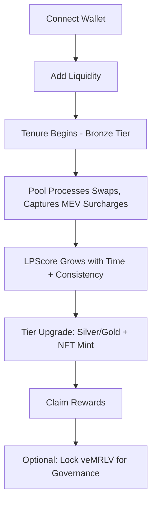
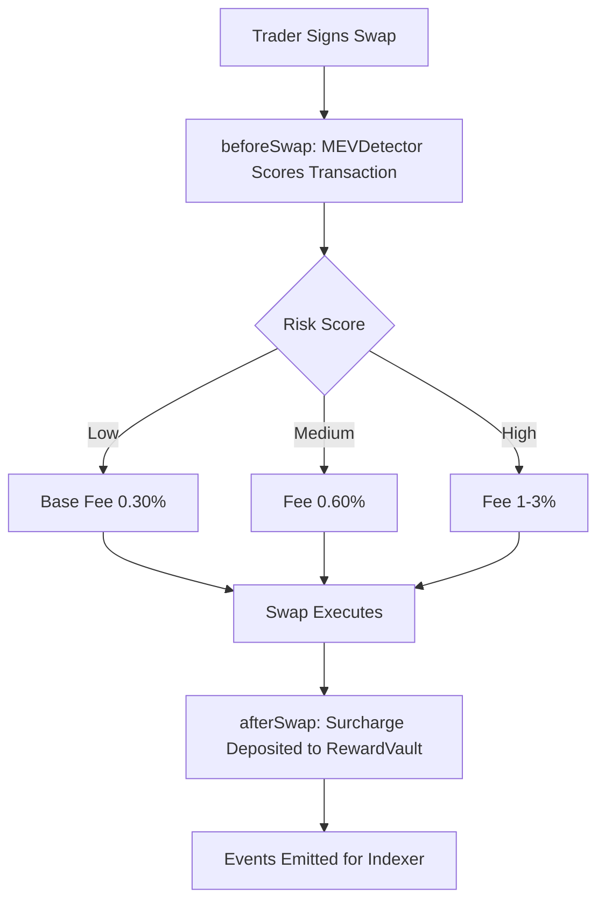

# PRD.md — Product Requirements Document
**Source of truth:** `MRLV_Architecture.md`. This document explains WHAT is being built and WHY. Anything not explicitly stated or directly inferable from the source is marked `Not specified` or `Inference`.

---

## 1. Product Overview

- **Product/project name:** MEV-Redistributive Liquidity Vault (MRLV)
- **One-paragraph description:** MRLV is a Uniswap v4 hook-based protocol that detects toxic MEV activity (sandwich attacks, JIT liquidity, toxic arbitrage) at the point of swap, applies a dynamic fee surcharge to flagged transactions, and redistributes that captured surcharge to long-term liquidity providers weighted by tenure and behavior — converting MEV from a pure negative externality into a liquidity incentive mechanism.
- **Problem being solved:** Liquidity providers on Uniswap v4 lose 15–40% of potential returns to impermanent loss and toxic MEV; existing MEV-defensive hooks (e.g., Detoxer) only penalize attackers without returning captured value to LPs.
- **Product vision:** *(Inference, based on Part 1.2's flywheel description)* — establish a self-reinforcing loop where detected MEV funds LP rewards, which attracts deeper long-term liquidity, which in turn reduces the profitability of future MEV attacks.
- **Product goals:**
  - Detect MEV-pattern transactions in real time within the swap transaction itself (no off-chain delay).
  - Capture additional protocol fees from flagged transactions without blocking or reverting trades.
  - Redistribute captured fees to long-term LPs via a tenure/behavior-weighted score.
  - Provide transparent, real-time analytics on MEV captured and rewards distributed.
  - Ship a working, demoable prototype within a 3-week hackathon timeline (Part 15).
- **Expected outcomes:** *(Inference)* — improved LP retention and deeper pool liquidity relative to non-MRLV pools; a reduction in realized MEV extraction per pool over time as the flywheel takes effect (Part 1.2, step 6).

---

## 2. Target Users

The source material does not define formal user personas. The following user types are directly inferable from the described functionality and are labeled as such.

### Liquidity Provider (LP) — *Inference*
- **Who they are:** Wallet holders who deposit token pairs into an MRLV-enabled Uniswap v4 pool.
- **Goals:** Earn fee yield with reduced exposure to MEV-driven value loss.
- **Needs:** Visibility into their position, LPScore, loyalty tier, and claimable rewards.
- **Pain points (from source):** Impermanent loss and toxic MEV eroding 15–40% of potential returns; short-term/shallow liquidity leading to worse slippage for everyone.
- **Interaction:** LP Dashboard (view position/rewards/tier), direct wallet transactions for add/remove liquidity and reward claims.

### Trader — *Inference*
- **Who they are:** Wallets executing swaps against an MRLV pool.
- **Goals:** Execute swaps at a fair, predictable fee.
- **Needs:** Visibility into the current dynamic fee tier before signing (Part 2.2, Trader Interface).
- **Pain points:** Not explicitly stated for traders beyond the general MEV/slippage problem described for the ecosystem.
- **Interaction:** Trader Interface (standard swap UI showing current fee tier).

### MEV Searcher / Attacker — *Inference (implicit counterparty)*
- **Who they are:** Wallets executing sandwich attacks, JIT liquidity attacks, or toxic arbitrage against MRLV pools.
- **Goals:** Not a served user — described only as the actor the system detects and taxes.
- **Interaction:** Subject to detection and dynamic fee surcharges; no dedicated interface.

### Governance Participant (veMRLV holder) — *Inference*
- **Who they are:** Holders of locked MRLV tokens (veMRLV) and Gold-tier loyalty NFT holders (Part 7.4).
- **Goals:** Influence bounded protocol parameters (fee multipliers, reward splits, volatility thresholds).
- **Needs:** Visibility into active proposals and voting power.
- **Interaction:** Governance Dashboard.

*No additional personas (e.g., protocol admins, auditors as active system users beyond review) are described in the source.*

---

## 3. User Stories

Only stories directly supported by described functionality are included.

- As an **LP**, I want to deposit liquidity into an MRLV pool, so that I begin accruing tenure toward a higher reward tier.
- As an **LP**, I want to view my current LPScore and loyalty tier, so that I understand my reward standing.
- As an **LP**, I want to claim my accrued rewards on demand, so that I control when I receive payouts (Part 3.5, pull-based claim).
- As an **LP**, I want to see a visual loyalty badge (NFT) reflecting my tier, so that my long-term commitment is recognized and displayed.
- As a **Trader**, I want to see the current dynamic fee before I sign a swap, so that fee changes are never a surprise (Part 2.2).
- As a **Trader**, I want my swap to always execute (even if flagged as suspicious), so that a false positive costs me a higher fee, not a failed transaction (Part 5.2).
- As a **Governance participant**, I want to propose and vote on bounded parameter changes, so that the protocol can adapt without redeploying contracts (Part 3.8).
- As any **user**, I want to view a public MEV Analytics Dashboard, so that I can verify how much MEV was captured and redistributed (Part 2.2, transparency layer).

---

## 4. Core Features

### Feature: MEV Detection Engine
- **Purpose:** Score each swap transaction for MEV-like patterns.
- **Description:** Aggregates four weighted signals into a 0–100 risk score (Part 5.1).
- **User value:** Enables fair, proportionate fee adjustment instead of blunt blocking.
- **Functional behavior:** Runs synchronously inside `beforeSwap`; reads transient storage (EIP-1153) and a governance-fed rolling priority-fee average.
- **Inputs:** `PoolKey`, `SwapParams`, `tx.gasprice`, `block.basefee`, transient-storage flags for same-block reversal/JIT.
- **Outputs:** `riskScore` (0–100).
- **Dependencies:** `MEVDetector.sol`, transient storage state set by `beforeAddLiquidity`.
- **Edge cases:** Legitimate large trades triggering "large price impact" alone (mitigated by multi-signal requirement for the top band, Part 5.2); network-wide gas spikes (mitigated by rolling, pool-specific baseline).
- **Acceptance criteria:** A same-block opposite-direction swap by the same `tx.origin` adds exactly +30 to the score; a JIT add→swap→remove pattern in one block adds exactly +40; total score is capped at 100.

### Feature: Dynamic Fee Engine
- **Purpose:** Convert a risk score into an actual pool swap fee.
- **Description:** Tiered fee schedule (0.30% / 0.60% / 1–3% linear) with a hard cap and per-block rate limiting (Part 6).
- **User value:** MEV activity is taxed proportionally; genuine traders are unaffected.
- **Functional behavior:** `computeFee(riskScore, poolId)` returns a fee, rate-limited against the pool's last applied fee.
- **Inputs:** `riskScore`, `poolId`.
- **Outputs:** `uint24` fee override returned to `PoolManager`.
- **Dependencies:** `DynamicFeeManager.sol`.
- **Edge cases:** Fee cannot exceed the 3% `HARD_CAP` regardless of score or governance vote; fee cannot move more than 3× its previous value in a single block.
- **Acceptance criteria:** Score <30 → 0.30% fee; 30–70 → 0.60% fee; ≥70 → linearly scaled 1–3%, capped at 3%.

### Feature: Reward Vault (MEV Fee Capture & Distribution)
- **Purpose:** Escrow captured surcharges and pay them to LPs.
- **Description:** Deposits happen per-swap in `afterSwap`; distribution is batched per epoch; claims are pull-based (Part 3.5, 7.1).
- **User value:** Converts captured MEV fees into real LP yield.
- **Functional behavior:** `deposit()` splits an optional insurance-pool cut from the distributable pool; `distribute()` allocates `claimable[lp]` per LPScore; `claim()` transfers tokens to the LP.
- **Inputs:** Captured surcharge amount, poolId, LPScores from `LoyaltyManager`.
- **Outputs:** Updated `claimable` balances; ERC-20 (veMRLV) token transfer on claim.
- **Dependencies:** `RewardVault.sol`, `LoyaltyManager.sol`, `MRLVToken.sol`.
- **Edge cases:** Reentrancy on `claim()` (mitigated via CEI + `nonReentrant`); double-distribution in the same block (mitigated via delta-based, idempotent-safe `distribute()`).
- **Acceptance criteria:** `claim()` transfers exactly `claimable[lp]`, zeroes the balance before the external transfer, and reverts safely on insufficient vault balance.

### Feature: LP Loyalty & Scoring System
- **Purpose:** Track LP tenure, consistency, and behavior to compute a fair reward-weighting score.
- **Description:** `LPScore` formula combines liquidity amount, duration, consistency, pool contribution, and a clean-behavior flag (Part 7.2).
- **User value:** Rewards long-term, well-behaved LPs over short-term/gaming behavior.
- **Functional behavior:** Recomputed on add/remove liquidity events and per distribution epoch.
- **Inputs:** `liquidityAmount`, `durationBlocks`, `consistencyIndex`, `poolContributionBps`, `flaggedMalicious`.
- **Outputs:** `LPScore` (used as a distribution weight), `tier` (Bronze/Silver/Gold).
- **Dependencies:** `LoyaltyManager.sol`.
- **Edge cases:** JIT liquidity (add+swap+remove same block) — detected and excluded from tenure credit; early withdrawal (<7-day window, exact window value `Not specified` beyond the "e.g., 7 days" example) forfeits a portion of accrued (not principal) rewards.
- **Acceptance criteria:** A flash-loaned same-block deposit/withdraw earns zero tenure-based score and is flagged by the JIT signal.

### Feature: Loyalty NFT Badges
- **Purpose:** Visually represent LP tenure/tier.
- **Description:** Soulbound (non-transferable) ERC-721 badges, minted/upgraded on tier crossing (Part 7.4).
- **User value:** Recognizable, demoable proof of long-term commitment; Gold tier grants additional governance voting weight.
- **Functional behavior:** `mintOrUpgradeLoyaltyNFT()` called from `LoyaltyManager` on tier threshold crossing.
- **Inputs:** LP address, new tier.
- **Outputs:** Minted/upgraded NFT with on-chain tier metadata and off-chain (IPFS) art.
- **Dependencies:** `LoyaltyManager.sol`, ERC-721 loyalty NFT contract.
- **Edge cases:** `transfer()`/`safeTransferFrom()` are overridden to revert (soulbound).
- **Acceptance criteria:** Badge tier always matches the LP's current on-chain tier; badges cannot be transferred between wallets.

### Feature: Governance
- **Purpose:** Allow veMRLV holders to vote on bounded protocol parameters.
- **Description:** Proposal → vote → timelocked queue → execute, restricted to whitelisted target contracts/functions (Part 3.8).
- **User value:** Decentralized, adaptable parameter tuning without redeployment.
- **Functional behavior:** `propose()`, `vote()`, `queue()`, `execute()` (post-timelock).
- **Inputs:** Target contract, call data, votes (veMRLV-weighted).
- **Outputs:** Executed parameter change (within hard-coded bounds).
- **Dependencies:** `Governance.sol`, `MRLVToken.sol` (voting power).
- **Edge cases:** A passed vote still cannot exceed hard-coded caps (e.g., 3% fee ceiling) — this is enforced in `DynamicFeeManager`/`RewardVault` bytecode, not by `Governance.sol` itself.
- **Acceptance criteria:** Every executed proposal passes through a 48–72h timelock (exact figure only given as an example range) before execution; `execute()` can only call whitelisted targets.

### Feature: MEV Analytics Dashboard
- **Purpose:** Public transparency into captured MEV and redistribution.
- **Description:** Shows MEV detected over time by risk band, fees captured vs. redistributed, per-pool resilience score, and flagged addresses (Part 10.1).
- **User value:** Builds trust by making the protocol's core claim (MEV → LP rewards) independently verifiable.
- **Functional behavior:** Reads from the Analytics Service, which aggregates indexed on-chain events.
- **Inputs:** Indexed `MEVDetected`, `FeeCaptured`, `RewardDistributed` events.
- **Outputs:** Aggregated charts/statistics.
- **Dependencies:** Indexer, PostgreSQL, Analytics Service.
- **Edge cases:** Dashboard figures are display-only; any user-actionable amount (e.g., claimable rewards) is re-verified live against the contract, never taken from this dashboard's cached data.
- **Acceptance criteria:** Not specified beyond "real-time view" — exact refresh cadence is `Not specified`.

---

## 5. Functional Requirements

- **FR-001:** The system shall compute a MEV risk score (0–100) for every swap inside `beforeSwap`, using at minimum the four signals defined in Part 5.1.
- **FR-002:** The system shall never revert or block a swap solely due to a high risk score; it shall only adjust the fee.
- **FR-003:** The system shall apply a fee of 0.30% for risk scores <30, 0.60% for 30–70, and a linearly scaled 1%–3% for scores ≥70.
- **FR-004:** The system shall enforce an absolute fee ceiling of 3%, independent of governance parameters.
- **FR-005:** The system shall rate-limit fee changes to no more than 3× the previous applied fee per block.
- **FR-006:** The system shall escrow captured fee surcharges in `RewardVault` rather than burning them or routing them exclusively to a treasury.
- **FR-007:** The system shall compute an `LPScore` per LP based on liquidity amount, duration, consistency, pool contribution, and clean-behavior status.
- **FR-008:** The system shall distribute captured rewards pro-rata by `LPScore` in batched, per-epoch distributions.
- **FR-009:** The system shall use a pull-based claim function for reward withdrawal; rewards shall never be pushed to LPs automatically during a swap.
- **FR-010:** The system shall detect JIT liquidity patterns (add→swap→remove within one block, same address) and exclude that liquidity from earning tenure-based score.
- **FR-011:** The system shall apply an exit penalty (forfeiting a portion of accrued, unclaimed rewards only) for liquidity removed before an early-withdrawal window.
- **FR-012:** The system shall mint or upgrade a non-transferable (soulbound) loyalty NFT when an LP crosses a tier threshold (Bronze/Silver/Gold).
- **FR-013:** The system shall restrict `Governance.execute()` to a whitelisted set of target contracts and functions.
- **FR-014:** The system shall enforce a timelock delay between a proposal passing and its execution.
- **FR-015:** The system shall emit all analytics-relevant events through a single `AnalyticsEmitter` contract.
- **FR-016:** The system shall index emitted events off-chain into a normalized database for dashboard consumption.
- **FR-017:** The system shall display the current dynamic fee to a trader before they sign a swap.
- **FR-018:** The system shall provide a governance-controlled pause function (`MRLVHook.paused`) that reverts all callbacks to a safe passthrough (base fee, no detection) without a timelock delay.

---

## 6. Non-Functional Requirements

- **Performance:** `beforeSwap` reads must be O(1) and bounded (transient-storage loads, single average comparison) to keep gas cost predictable on every swap (Part 4.2). Exact gas budget/target: `Not specified`.
- **Security:** See Part 12 of the architecture doc — reentrancy protection, hookData validation, oracle staleness checks, transient-storage namespacing, flash-loan resistance, fee-manipulation caps, reward-farming/Sybil resistance, governance whitelisting. Threat-by-threat mitigations are documented in `Architecture.md` of this set.
- **Scalability:** Multi-chain deployment intended (Ethereum mainnet, with Arbitrum and Base as first L2 expansions, Part 14). Specific throughput/TPS targets: `Not specified`.
- **Reliability:** Indexer must handle chain reorgs via a confirmation buffer before writing "final" rows (Part 9.1). Uptime targets: `Not specified`.
- **Accessibility:** `Not specified` in the source.
- **Maintainability:** Hook contract is explicitly designed thin (dispatcher-only) so that a bug in one module doesn't require re-auditing swap-critical logic (Part 3.2).
- **Availability:** `Not specified`.
- **Data integrity:** Database is described as a read-optimized cache populated only from indexed on-chain events, never a source of truth for fund-affecting logic (Part 8, closing note).
- **Privacy:** Flagged-address lists on the MEV Analytics Dashboard show addresses only, no personal data (Part 10.1).
- **Compatibility:** Built specifically against Uniswap v4's `PoolManager`/`IHooks` singleton architecture; not compatible with v3 or non-v4 AMMs by design.

---

## 7. User Flows

### LP Lifecycle (Inference, synthesized from Parts 4, 7, and 16.6)

### Swap Flow (from Part 11.1/11.2)

Additional flows (MEV attack sequence, reward claim sequence) are documented as sequence diagrams in Part 11 of `MRLV_Architecture.md` and are not duplicated here to avoid redundancy — see `Architecture.md` in this set.

---

## 8. Acceptance Criteria (Major Features Summary)

| Feature | Acceptance Criteria |
|---|---|
| MEV Detection | Score correctly sums the four defined signals; capped at 100; never blocks a swap |
| Dynamic Fee | Fee matches the tiered formula exactly; never exceeds 3%; rate-limited to ≤3× per block |
| Reward Vault | `claim()` is reentrancy-safe and pull-based; distribution is idempotent per epoch |
| Loyalty/LPScore | JIT and flash-loan patterns earn zero tenure credit; early exits forfeit only accrued rewards |
| Loyalty NFT | Soulbound; tier always reflects current on-chain state |
| Governance | All executions pass through a timelock and are restricted to whitelisted targets |

---

## 9. Scope

### In Scope (explicitly described and prioritized for the 3-week build, Part 15)
- Core hook (`MRLVHook.sol`) with all seven v4 callbacks.
- MEV detection (priority fee anomaly, same-block reversal, price impact, JIT pattern).
- Dynamic fee engine with tiering, caps, and rate limiting.
- Reward Vault (deposit/distribute/claim).
- Loyalty Manager (LPScore, tiers, JIT/exit penalties).
- Soulbound loyalty NFTs.
- Indexer, PostgreSQL database, backend API.
- LP Dashboard and MEV Analytics Dashboard (explicitly flagged as the two highest-priority demo surfaces).
- Governance Dashboard ("as time permits" — Part 15, Week 3).

### Out of Scope (explicitly described as stretch/optional only)
- Cross-Pool MEV Blacklist / reputation system.
- Dynamic reward multipliers based on external volatility oracle feeds.
- Auto-compounding ERC-4626 reward vault wrapper.
- MEV Insurance Pool as a fully separate claimable product (only a basic `insuranceBps` split is in the core `RewardVault` design; the full claims-based insurance mechanism described in the research document is not carried into the core 3-week scope).

### Future/Planned
- Migration from a custom indexer to a full Graph subgraph post-hackathon (Part 14).
- Expansion beyond Ethereum mainnet to Arbitrum and Base (Part 14, described as "first L2 expansions," implying mainnet ships first).
- Stretch goals listed in Part 15 (cross-pool blacklist, volatility-scaled multiplier, auto-compounding vault) if the 3-week team is ahead of schedule.

Scope for anything beyond the above (e.g., mobile app, non-EVM chains, token pricing/tokenomics beyond the reward mechanism itself) is `Not specified`.
