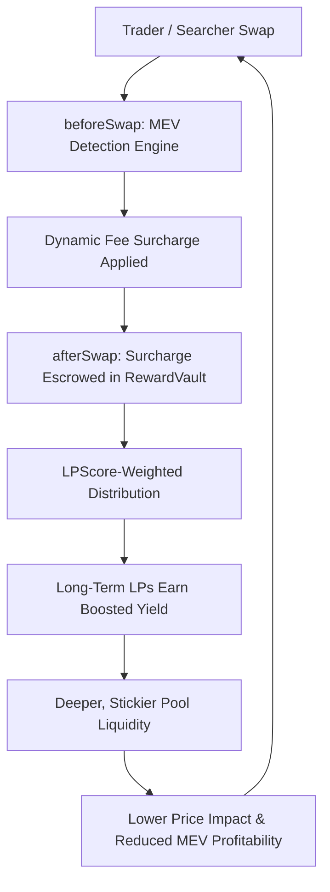
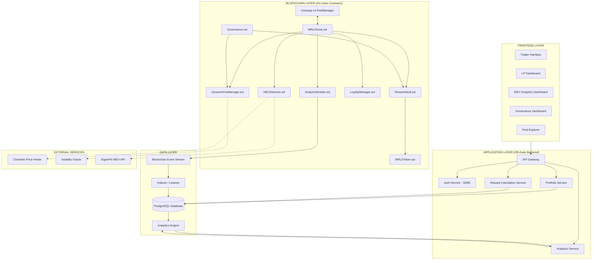

# MEV-Redistributive Liquidity Vault (MRLV)

> **A Uniswap v4 hook-based protocol that detects toxic MEV at the point of swap, taxes suspicious transactions with a dynamic fee surcharge, and redistributes captured value to long-term LPs based on tenure and behavior.**

[](https://uniswap.org)
[](https://book.getfoundry.sh/)
[](https://soliditylang.org/)
[](LICENSE)

---

## 📖 Table of Contents

- [1. System Overview & Concept](#1-system-overview--concept)
- [2. The MRLV Flywheel](#2-the-mrlv-flywheel)
- [3. System Architecture](#3-system-architecture)
  - [3.1 Layered Architecture Diagram](#31-layered-architecture-diagram)
  - [3.2 Component Breakdown](#32-component-breakdown)
- [4. MEV Detection Engine](#4-mev-detection-engine)
- [5. Dynamic Fee Mechanism](#5-dynamic-fee-mechanism)
- [6. LP Loyalty & Reward Redistribution](#6-lp-loyalty--reward-redistribution)
- [7. Implementation Roadmap (3-Week Build)](#7-implementation-roadmap-3-week-build)
- [8. Key Engineering Guardrails](#8-key-engineering-guardrails)
- [9. Repository Structure & Source Documents](#9-repository-structure--source-documents)
- [10. Development & Usage Guide](#10-development--usage-guide)
- [11. Git Commit Log & Context](#11-git-commit-log--context)

---

## 1. System Overview & Concept

### The Problem
On Uniswap v4 pools, liquidity providers (LPs) face severe yield erosion:
- LPs lose **15–40% of potential returns** to impermanent loss (IL) and toxic MEV (sandwich attacks, JIT liquidity, toxic arbitrage).
- Over **60% of v4 liquidity is short-term** (<30 days), resulting in shallow pools and high slippage for traders.
- Traditional MEV-defensive hooks (e.g. Detoxer) penalize attackers by raising fees, but the captured value is burned or sent to a protocol treasury—leaving LPs uncompensated for the risk they bear.

### The MRLV Solution
**MEV-Redistributive Liquidity Vault (MRLV)** transforms MEV from a pure negative externality into a sustainable liquidity incentive:
1. **Detects** MEV-like transaction patterns in real time inside `beforeSwap` without off-chain delay.
2. **Taxes** flagged transactions with a dynamic fee surcharge (up to 3%).
3. **Escrows** captured surcharges in `RewardVault.sol`.
4. **Redistributes** escrowed rewards to long-term LPs based on a tenure- and behavior-weighted `LPScore`.

> 💡 **Legal & Technical Clarification:** MRLV captures additional protocol fees generated from detected MEV activity—it does not claim, seize, or redirect a third party's realized MEV profit.

---

## 2. The MRLV Flywheel



### Flywheel Mechanics
1. **Taxation at Point of Swap:** MEV activity is detected and taxed synchronously inside the swap transaction (zero new trust assumptions).
2. **Surcharge Escrow:** The fee delta between base fee and MEV fee is deposited into `RewardVault.sol`.
3. **LPScore Allocation:** Rewards accrue to LPs according to tenure, consistency, contribution share, and a clean behavior flag.
4. **Yield Boost:** Long-term LPs receive higher yield compared to passive pools.
5. **Deeper Liquidity:** Superior yield retains LPs long term, deepening pool reserves.
6. **MEV Deterrence:** Deeper pools reduce price impact per trade, mechanically shrinking sandwich attack profitability and improving execution for genuine traders.

---

## 3. System Architecture

MRLV is structured into five distinct operational layers: **Blockchain**, **Application Backend**, **Data Store**, **Frontend**, and **External Services**.

### 3.1 Layered Architecture Diagram



### 3.2 Component Breakdown

#### On-Chain Smart Contracts (`src/`)
- **[MRLVHook.sol](file:///c:/Users/Akshad/MEV-Redistributive%20Liquidity%20Vault/Architecture.md#L120)**: Thin dispatcher hook implementing Uniswap v4 `IHooks`. Dispatches callbacks to specialist modules; contains zero business logic.
- **[MEVDetector.sol](file:///c:/Users/Akshad/MEV-Redistributive%20Liquidity%20Vault/Architecture.md#L121)**: Evaluates swaps in real time across four weighted signals, returning a `riskScore` (0–100).
- **[DynamicFeeManager.sol](file:///c:/Users/Akshad/MEV-Redistributive%20Liquidity%20Vault/Architecture.md#L122)**: Converts `riskScore` into a bounded fee with rate limiting and a 3% hard cap.
- **[RewardVault.sol](file:///c:/Users/Akshad/MEV-Redistributive%20Liquidity%20Vault/Architecture.md#L123)**: Escrows captured surcharges, manages epoch distributions, and executes pull-based reward claims.
- **[LoyaltyManager.sol](file:///c:/Users/Akshad/MEV-Redistributive%20Liquidity%20Vault/Architecture.md#L124)**: Tracks LP tenure/consistency, computes `LPScore`, filters JIT liquidity, and manages loyalty NFT tiers.
- **[MRLVToken.sol](file:///c:/Users/Akshad/MEV-Redistributive%20Liquidity%20Vault/Architecture.md#L125)**: ERC-20 token used for reward payout and veMRLV locked governance voting weight.
- **[Governance.sol](file:///c:/Users/Akshad/MEV-Redistributive%20Liquidity%20Vault/Architecture.md#L126)**: Timelocked governance allowing veMRLV holders to adjust whitelisted protocol parameters.
- **[AnalyticsEmitter.sol](file:///c:/Users/Akshad/MEV-Redistributive%20Liquidity%20Vault/Architecture.md#L127)**: Centralized event emitter for off-chain indexing.

#### Off-Chain Application & Data Layer
- **Indexer & PostgreSQL**: Subscribes to `AnalyticsEmitter` events with a confirmation buffer to handle reorgs safely.
- **API Gateway & Services**: Exposes `/pools`, `/lp/:address`, `/mev/analytics`, and `/governance/*` endpoints using SIWE (Sign-In With Ethereum) authentication.

---

## 4. MEV Detection Engine

`MEVDetector.sol` evaluates each transaction during `beforeSwap` using four synchronous signals:

| Signal | Point Value | Detection Mechanism |
|---|---|---|
| **Priority Fee Anomaly** | +30 | Current transaction gas priority fee exceeds rolling 7-day pool average by threshold multiplier |
| **Same-Block Reversal** | +30 | Same `tx.origin` executes an opposite-direction swap within the current block (transient storage EIP-1153) |
| **JIT Pattern Flag** | +40 | Add liquidity $\rightarrow$ swap $\rightarrow$ remove liquidity pattern within a single block |
| **Large Price Impact** | +20 | Swap size causes price impact exceeding pool volatility threshold |

- **Total Risk Score**: Sum of active signals, capped at **100**.
- **Non-blocking Guarantee**: Transactions are **never blocked or reverted** due to risk score alone; high-risk trades simply pay a higher fee.

---

## 5. Dynamic Fee Mechanism

`DynamicFeeManager.sol` calculates swap fees based on `riskScore`:

```
           ┌── 0.30% (Base Fee)                     if riskScore < 30
Swap Fee = ├── 0.60% (Suspicious Tier)              if 30 <= riskScore < 70
           └── 1.00% - 3.00% (Linear Scaling Tier)  if riskScore >= 70
```

### Safety Constraints
- **Hard Cap (`HARD_CAP`)**: Bytecode-enforced maximum fee of **3.00%** (immutable by governance).
- **Per-Block Rate Limit**: Applied fee cannot increase by more than **3×** its previous value in a single block.

---

## 6. LP Loyalty & Reward Redistribution

### LPScore Formula
Rewards are distributed pro-rata by `LPScore`:

$$\text{LPScore} = \text{LiquidityAmount} \times \text{DurationBlocks} \times \text{ConsistencyIndex} \times \text{PoolContributionBps} \times \text{CleanBehaviorFlag}$$

### Key Rules
- **Anti-JIT Exclusion**: Same-block deposit/withdraw pairs earn zero tenure credit.
- **Early Exit Penalty**: Liquidity withdrawn before the early-withdrawal window forfeits accrued rewards (principal is never penalized).
- **Pull-Based Claims**: LPs withdraw rewards on demand via `RewardVault.claim()` (prevents push-payment reentrancy vectors).
- **Soulbound Loyalty NFTs**: Non-transferable ERC-721 badges minted/upgraded upon reaching Bronze, Silver, or Gold tiers.

---

## 7. Implementation Roadmap (3-Week Build)

```
Phase 1: Core Hook, Detection & Fees (Week 1)
  ├── Uniswap v4 PoolManager Setup & CREATE2 Hook Address Mining
  ├── MRLVHook.sol & MEVDetector.sol (4 signals)
  └── DynamicFeeManager.sol (tiered fee, 3% cap, 3x rate limit)

Phase 2: Reward System, Loyalty & NFTs (Week 2)
  ├── RewardVault.sol (deposit, epoch distribute, pull-based claim)
  ├── LoyaltyManager.sol & LPScore computation
  └── Soulbound ERC-721 Loyalty Badges & MRLVToken.sol

Phase 3: Dashboards, Analytics & Demo (Week 3)
  ├── Event Indexer & PostgreSQL Database Setup
  ├── Backend SIWE Auth & REST API
  ├── LP Dashboard & MEV Analytics Dashboard
  └── End-to-End Demo Script & Gas Profiling
```

---

## 8. Key Engineering Guardrails

Defined in [Rules.md](file:///c:/Users/Akshad/MEV-Redistributive%20Liquidity%20Vault/Rules.md):
1. **Thin Hook Dispatcher**: `MRLVHook.sol` dispatches only; business logic resides entirely in specialist contracts.
2. **Transient Storage (EIP-1153)**: Used for intra-block MEV state tracking; no persistent storage writes on normal swaps.
3. **Pull-Payment Pattern**: All reward claims are pull-based (`claim()`); rewards are never pushed during swaps.
4. **Immutable Hard Cap**: The 3% fee ceiling is hardcoded in bytecode and cannot be overridden by governance.
5. **Direct Wallet Signing**: Claims, votes, and liquidity operations are signed directly by user wallets—never relayed by backend servers.

---

## 9. Repository Structure & Source Documents

The project architecture and requirements are defined across six primary markdown documents:

| Document | Description |
|---|---|
| 📄 **[PRD.md](file:///c:/Users/Akshad/MEV-Redistributive%20Liquidity%20Vault/PRD.md)** | Product Requirements Document (User stories, core features, functional & non-functional requirements) |
| 🏗️ **[Architecture.md](file:///c:/Users/Akshad/MEV-Redistributive%20Liquidity%20Vault/Architecture.md)** | Technical Architecture (5-layer system breakdown, data schema, contract interactions, API specification) |
| 🎨 **[Design.md](file:///c:/Users/Akshad/MEV-Redistributive%20Liquidity%20Vault/Design.md)** | UI/UX Specification (Dashboard specifications, trader interface requirements, loyalty NFT metadata) |
| 🗓️ **[Phases.md](file:///c:/Users/Akshad/MEV-Redistributive%20Liquidity%20Vault/Phases.md)** | Implementation Roadmap (Week 1–3 phase deliverables, dependencies, and validation criteria) |
| 🛡️ **[Rules.md](file:///c:/Users/Akshad/MEV-Redistributive%20Liquidity%20Vault/Rules.md)** | AI & Engineering Rules (Contract design constraints, security guardrails, testing rules) |
| 📚 **[MRLV_Architecture (1).md](file:///c:/Users/Akshad/MEV-Redistributive%20Liquidity%20Vault/MRLV_Architecture%20%281%29.md)** | Full Master Reference Architecture Document |

---

## 10. Development & Usage Guide

Built with **[Foundry](https://book.getfoundry.sh/)**.

### Prerequisites
- [Git](https://git-scm.com/)
- [Foundry](https://getfoundry.sh/) (`forge`, `cast`, `anvil`)

### Installation & Build

```shell
# Clone the repository
git clone https://github.com/akshadgujarkar/MEV-Redistributive-Liquidity-Vault.git
cd MEV-Redistributive-Liquidity-Vault

# Install dependencies
forge install

# Build smart contracts
forge build
```

### Running Tests

```shell
# Run unit and fuzz tests
forge test

# Run tests with detailed verbosity
forge test -vvvv

# Gas snapshot
forge snapshot
```

### Formatting

```shell
forge fmt
```

### Local Node & Deployment

```shell
# Start local Anvil node
anvil

# Deploy hook script
forge script script/Counter.s.sol:CounterScript --rpc-url http://localhost:8545 --private-key <PRIVATE_KEY>
```

---

## 11. Git Commit Log & Context

### Branch Information
- **Current Branch:** `akshad`
- **Upstream Repository:** `https://github.com/akshadgujarkar/MEV-Redistributive-Liquidity-Vault.git`

### Relevant Commits
- [`fed84b6`](file:///c:/Users/Akshad/MEV-Redistributive%20Liquidity%20Vault) — `MRVL_Architecture files and all relevant files are added to the root folder`
  - Added `PRD.md`, `Architecture.md`, `Design.md`, `Phases.md`, `Rules.md`, and `MRLV_Architecture (1).md` to the root folder on `main`.
- Current Commit (`akshad` branch) — `docs: update README.md with comprehensive MRLV concept, system architecture, MEV engine, and commit history`
  - Fully transformed `README.md` into the primary project entry point and technical guide.
